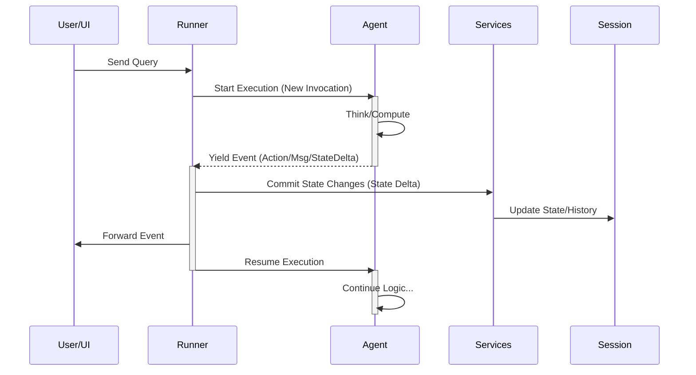

# ADK Runtime Overview

This note summarizes the [Google Agent Development Kit (ADK) Runtime](https://google.github.io/adk-docs/runtime/) architecture, detailing how the various components collaborate to process a user request.

## The Event Loop Flow

The runtime operates on a strict **Event Loop** managed by the [Runner](Machine%20Learning/Google%20AI%20Agent/ADK%20Documentation/Runtime/Runner.md). The flow of execution for a single user interaction is as follows:

1.  **User Input**: The process begins when the [Runner](Machine%20Learning/Google%20AI%20Agent/ADK%20Documentation/Runtime/Runner.md) receives a user query. This triggers a new [Invocation](Machine%20Learning/Google%20AI%20Agent/ADK%20Documentation/Runtime/Invocation.md).
2.  **Kick-off**: The Runner initializes the [Invocation Context](Machine%20Learning/Google%20AI%20Agent/ADK%20Documentation/Runtime/Invocation_Context.md) and calls the `_run_async_impl` method of the main [Agent](Machine%20Learning/Google%20AI%20Agent/ADK%20Documentation/Runtime/Agent.md).
3.  **Agent Execution**: The Agent executes its logic (e.g., calling an LLM) until it determines an action is needed (like sending a message or calling a tool).
4.  **Yield Event**:
    *   The Agent constructs an [Event](Machine%20Learning/Google%20AI%20Agent/ADK%20Documentation/Runtime/Event.md) object representing this action.
    *   If state changes were made, a [State Delta](Machine%20Learning/Google%20AI%20Agent/ADK%20Documentation/Runtime/State_Delta.md) is included.
    *   If an artifact was created, an [Artifact](Machine%20Learning/Google%20AI%20Agent/ADK%20Documentation/Runtime/Artifact.md) delta is included.
    *   The Agent `yields` the event to the Runner.
    *   **CRITICAL STEP**: The Agent *pauses* execution immediately after the yield. It waits.
5.  **Runner Processing**:
    *   The Runner receives the Event.
    *   It inspects the event for side effects (e.g., [State_Delta](Machine%20Learning/Google%20AI%20Agent/ADK%20Documentation/Runtime/State_Delta.md)).
    *   It uses [Services](Machine%20Learning/Google%20AI%20Agent/ADK%20Documentation/Runtime/Services.md) to commit these changes to the [Session](Machine%20Learning/Google%20AI%20Agent/ADK%20Documentation/Runtime/Session.md). This ensures the state is safely persisted.
    *   The Runner forwards the processed event upstream to the UI.
6.  **Agent Resumption**:
    *   Once the Runner finishes processing, it signals the Agent to resume.
    *   The Agent continues execution from the exact line where it paused.
    *   Because the Runner has already updated the Session, the Agent resumes with a guarantee that the system state is consistent and up-to-date.
7.  **Loop**: This cycle (Execute -> Yield -> Pause -> Process -> Resume) repeats until the Agent completes its logic for the current invocation.

## Component Interaction Diagram (Conceptual)

## Summary

The ADK Runtime is designed to separate **logic** from **state management**. The [Agent](Machine%20Learning/Google%20AI%20Agent/ADK%20Documentation/Runtime/Agent.md) focuses on *what* should happen by yielding [Event](Machine%20Learning/Google%20AI%20Agent/ADK%20Documentation/Runtime/Event.md) objects. The [Runner](Machine%20Learning/Google%20AI%20Agent/ADK%20Documentation/Runtime/Runner.md) handles *how* that happens by coordinating with [Services](Machine%20Learning/Google%20AI%20Agent/ADK%20Documentation/Runtime/Services.md) to update the [Session](Machine%20Learning/Google%20AI%20Agent/ADK%20Documentation/Runtime/Session.md). This architecture ensures reliability, state consistency, and a clear separation of concerns.

## Further Reading

- **[Runtime Behaviors](Machine%20Learning/Google%20AI%20Agent/ADK%20Documentation/Runtime/Runtime_Behaviors.md)**: Deep dive into state consistency, dirty reads, and output streaming.
- **[Async Architecture](Machine%20Learning/Google%20AI%20Agent/ADK%20Documentation/Runtime/Async_Architecture.md)**: Explanation of the asynchronous design philosophy.
